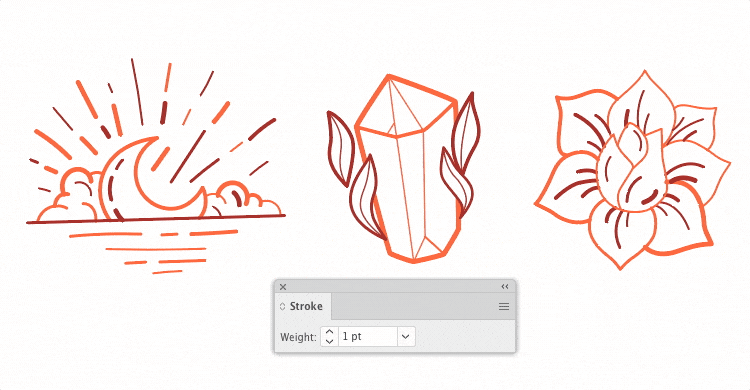

[BatchRenamer.jsx](./BatchRenamer.jsx)

 


```jsx
/*
  AverageStrokesWidth.jsx for Adobe Illustrator
  Description: Averages the stroke width of selected objects, skipping those without strokes. Supports paths, compound paths and text objects
  Date: February, 2023
  Author: Sergey Osokin, email: hi@sergosokin.ru

  Installation: https://github.com/creold/illustrator-scripts#how-to-run-scripts

  Release notes:
  0.1 Initial version

  Donate (optional):
  If you find this script helpful, you can buy me a coffee
  - via Buymeacoffee: https://www.buymeacoffee.com/osokin
  - via FanTalks https://fantalks.io/r/sergey
  - via DonatePay https://new.donatepay.ru/en/@osokin
  - via YooMoney https://yoomoney.ru/to/410011149615582

  NOTICE:
  Tested with Adobe Illustrator CC 2019-2023 (Mac/Win).
  This script is provided "as is" without warranty of any kind.
  Free to use, not for sale

  Released under the MIT license
  http://opensource.org/licenses/mit-license.php

  Check my other scripts: https://github.com/creold
*/

//@target illustrator
app.preferences.setBooleanPreference('ShowExternalJSXWarning', false); // Fix drag and drop a .jsx file

// Main function
function main() {
  if (!isCorrectEnv('selection')) return;

  var items = getStrokedItems(selection, true);
  if (!items.length) return;

  var totalW = getTotalWidth(items),
      avgW = 1 * (totalW / items.length).toFixed(2);

  items = getStrokedItems(selection, false);
  for (var i = 0, len = items.length; i < len; i++) {
    setStrokeWidth(items[i], avgW);
  }
}

// Check the script environment
function isCorrectEnv() {
  var args = ['app', 'document'];
  args.push.apply(args, arguments);
  for (var i = 0; i < args.length; i++) {
    var arg = args[i].toString().toLowerCase();
    switch (true) {
      case /app/g.test(arg):
        if (!/illustrator/i.test(app.name)) {
          alert('Wrong application\nRun script from Adobe Illustrator', 'Script error');
          return false;
        }
        break;
      case /version/g.test(arg):
        var rqdVers = parseFloat(arg.split(':')[1]);
        if (parseFloat(app.version) < rqdVers) {
          alert('Wrong app version\nSorry, script only works in Illustrator v.' + rqdVers + ' and later', 'Script error');
          return false;
        }
        break;
      case /document/g.test(arg):
        if (!documents.length) {
          alert('No documents\nOpen a document and try again', 'Script error');
          return false;
        }
        break;
      case /selection/g.test(arg):
        if (!selection.length || selection.typename === 'TextRange') {
          alert('Nothing selected\nPlease, select two or more paths', 'Script error');
          return false;
        }
        break;
    }
  }
  return true;
}

// Get paths from selection
function getStrokedItems(coll, isFirstPath) {
  var out = [];
  for (var i = 0; i < coll.length; i++) {
    var item = coll[i];
    if (isType(item, 'group') && item.pageItems.length) {
      out = [].concat(out, getStrokedItems(item.pageItems));
    } else if (isType(item, '^compound') && item.pathItems.length) {
      // Get only first path from PathItems collection
      if (isFirstPath) {
        if (isHasStroke(item.pathItems[0])) out.push(item.pathItems[0]);
      } else {  // Get all PathItems
        out = [].concat(out, getStrokedItems(item.pathItems));
      }
    } else if (isType(item, 'path|text')) {
      if (isHasStroke(item)) out.push(item);
    }
  }
  return out;
}

// Check the item typename by short name
function isType(item, type) {
  var regexp = new RegExp(type, 'i');
  return regexp.test(item.typename);
}

// Check for a stroke
function isHasStroke(item) {
  if (isType(item, 'text')) {
    var attr = item.textRange.characterAttributes;
    return !/nocolor/i.test(attr.strokeColor) && attr.strokeWeight > 0;
  }
  return item.stroked && item.strokeWidth > 0;
}

// Get the sum of the stroke widths
function getTotalWidth(coll) {
  var total = 0;
  for (var i = 0, len = coll.length; i < len; i++) {
    if (isType(coll[i], 'text')) {
      var attr = coll[i].textRange.characterAttributes;
      total += attr.strokeWeight;
    } else {
      total += coll[i].strokeWidth;
    }
  }
  return total;
}

// Set stroke width
function setStrokeWidth(item, val) {
  if (val == undefined || val == 0) return;
  if (isType(item, 'text')) {
    var attr = item.textRange.characterAttributes;
    attr.strokeWeight = val;
  } else {
    item.strokeWidth = val;
  }
}

// Run script
try {
  main();
} catch (err) {}```